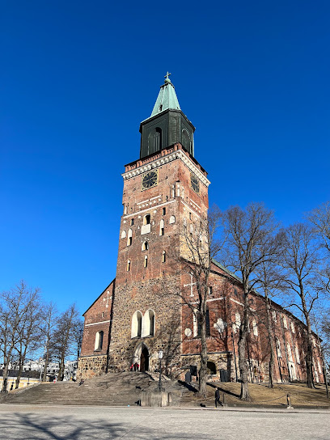
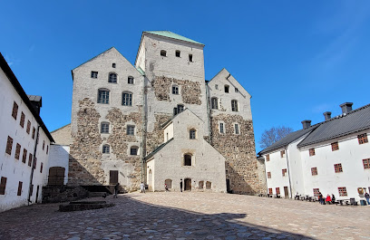
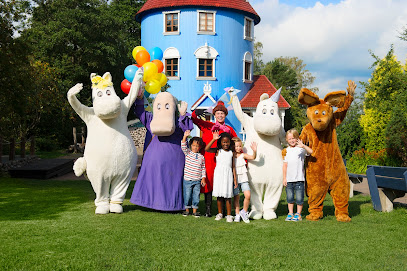

# Finlandia

## Helsinki

## Turku

**Katedra w Turku** Turun tuomiokirkko 
 
**Zamek w Turku** Turun linna

**Świat Muminków** Muumimaailma

## Oulu

## Wioska Świętego Mikołaja

## NordKapp (Norwegia)