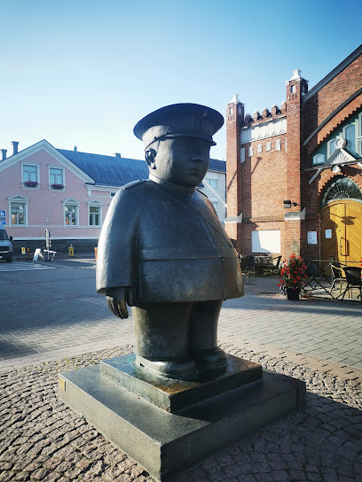
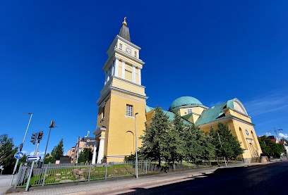

# Finlandia

 

## Helsinki

Pałac prezydencki *(Presidentinlinna)*
Sobór Uspieński *(Uspenskin katedraali)*
Plac Senacki *(Senaatintori)*
Katedra w Helsinkach *(Helsingin tuomiokirkko)*
Plac Targowy w Helsinkach *(Kauppatori)*
Old Market Hall *(Vanha kauppahalli)*
Suomenlinna
Kościół Temppeliaukio *(Temppeliaukion kirkko)*
Pomnik Sibeliusa w Helsinkach *(Sibelius-monumentti)*

## Turku

**Katedra w Turku** Turun tuomiokirkko 
 
**Zamek w Turku** Turun linna

**Świat Muminków** Muumimaailma

## Oulu

***Toripolliisi Statue***

***Katedra w Oulu*** [Oulun tuomiokirkko](https://www.oulunseurakunnat.fi/) 

## Wioska Świętego Mikołaja

### Rovaniemi
[**Arktikum**](http://www.arktikum.fi/)
[**Święty Mikołaj Baza** *Santa Claus Office*](https://santaclausoffice.com/)

## NordKapp (Norwegia)